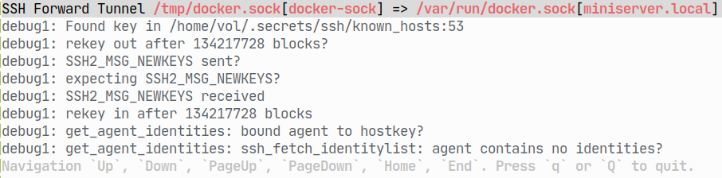
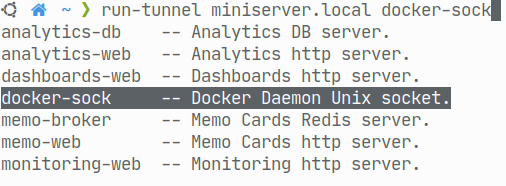
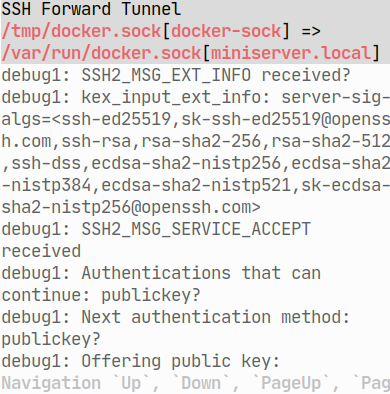

## Description

The smart tui for seeing ssh tunnel logs.

Features:

- CLI autocompletion from a config.
- Highlighting tunnel addresses.
- Navigation with a keyboard.
- Resizing automatically with terminal or tmux panel size.

## Dependencies

- [typer](https://github.com/tiangolo/typer)
- [urwid](https://github.com/urwid/urwid)
- [sh](https://github.com/amoffat/sh)

## Usage

`$ run-tunnel miniserver.local docker-sock`

## Screenshots

- Running

  

- Autocompletion

  

- Resizing

  